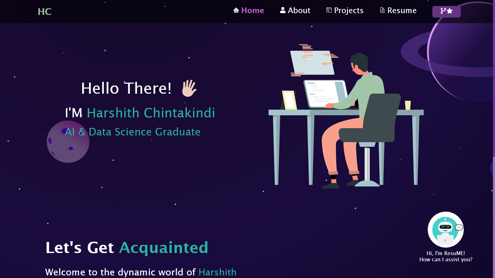

# Personal Portfolio – Harshith Chintakindi

## 📌 Overview

This is my personal portfolio website built with **React.js**, featuring:

- My resume, GitHub projects, and skills
- Fully responsive and animated frontend
- A smart chatbot trained using a fine-tuned **T5 model**, deployed with a **FastAPI** backend on Hugging Face Spaces

---

## ✨ Features

### 🌐 Frontend

- Multi-page layout
- Fully responsive design
- Preloader animation
- Typing and scroll effects
- Resume preview and download
- React + Vercel Deployment

### 🤖 Chatbot

- Answering personalized questions about me
- Trained using T5 on a custom Q&A dataset
- Uses sentence similarity with `SentenceTransformer`
- Hosted via FastAPI on Hugging Face Spaces

---

## 🧠 Technologies Used

### Frontend

- React.js
- Vercel
- `lottie-react` – animations
- `react-spinners` – preloader animation
- `react-icons` – icon packs
- `typewriter-effect` – typing effect
- `react-parallax-tilt` – tilt hover effect

### Backend

- FastAPI
- Hugging Face Transformers (`t5-small`)
- SentencePiece
- Sentence Transformers (`all-MiniLM-L6-v2`)
- PyTorch
- spaCy (`en_core_web_sm`)
- Hugging Face Spaces

---

## 🌐 Live Demos

- 🔗 **Frontend** (Vercel): [https://chbsh.vercel.app](https://chbsh.vercel.app)  
- 🔗 **Backend** (Hugging Face): [https://harshith1817-portfolio.hf.space](https://harshith1817-portfolio.hf.space)